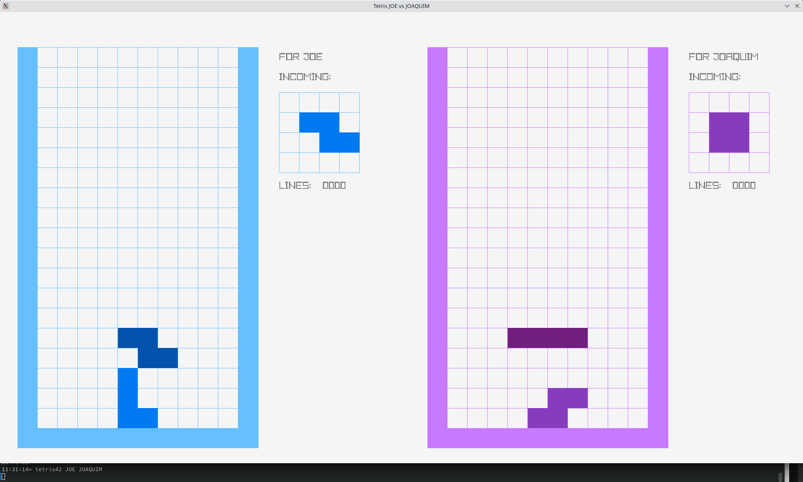

# Tetris42

Tetris tournament for up to 4 players. After a while the game moves on to more complicated forms.

## [Releases download](https://github.com/tpanj/tetris42/releases) 

## Controls: __Rotate, movements.._

1. Player
    * `Keys_↑←↓→`
1. Players
    * `KEYS_WASD`  for player 1 on left
    * `Keys_↑←↓→`  for player 2 on right
1. Players
    * `KEYS_WASD`  for player 1 on left
    * `Keys_↑←↓→`  for player 2 on right
    * `GPAD1_5876` for player 3 below
1. Players
    * `KEYS_WASD`  for player 1 on left
    * `Keys_↑←↓→`  for player 2 on right
    * `GPAD1_5876` for player 3 on left below
    * `GPAD2_5876` for player 4 on right below
